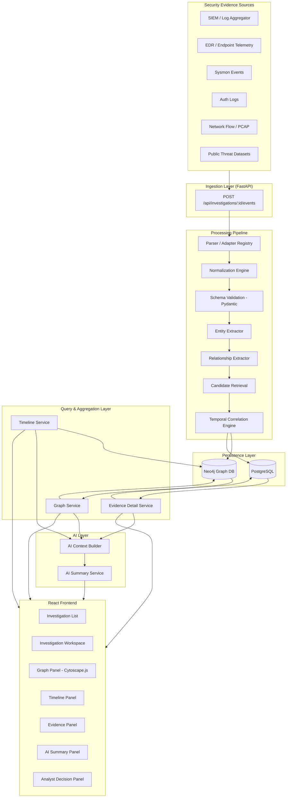
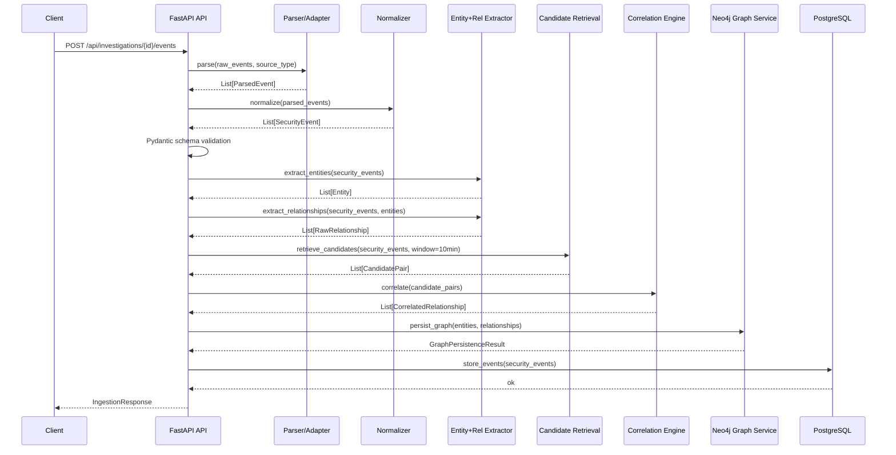
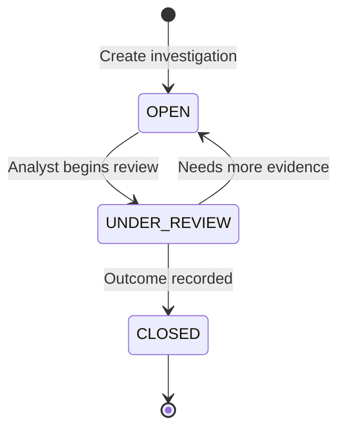

# Design Document: TraceGraph

## Overview

TraceGraph is a modular security investigation platform that converts scattered security evidence — logs, alerts, and telemetry from disparate sources — into a structured, explainable investigation context. Rather than flooding analysts with raw events, TraceGraph extracts entities and relationships, correlates them temporally through rule-based signals, persists the result as a traversable graph in Neo4j, and surfaces that context through a React workspace with an optional AI-assisted narrative summary.

The platform is designed for explainability first: every relationship in the graph traces back to concrete evidence, every correlation signal is named and inspectable, and the AI summary layer is constrained to what the evidence actually contains. Analysts retain full control — they can pivot through the graph, annotate findings, and record investigation outcomes. The system degrades gracefully if any component (including AI) is unavailable.

TraceGraph separates concerns into a strict pipeline: ingest → parse → normalize → validate → extract → correlate → persist → query → summarize → interact. Each stage has a well-defined input/output contract, allowing independent testing, replacement, and scaling.

---

## Architecture

### High-Level System Architecture



### Pipeline Sequence for a Single Event Batch



### Investigation Lifecycle



---

## Components and Interfaces

### Component 1: Evidence Ingestion API

**Purpose**: Accept raw security events from external sources, route them through the processing pipeline, and return a structured ingestion result.

**Interface**:
```python
# Single event
POST /api/investigations/{investigation_id}/events
Content-Type: application/json
Body: RawEventPayload

# Batch events
POST /api/investigations/{investigation_id}/events/batch
Content-Type: application/json
Body: List[RawEventPayload]
```

**Responsibilities**:
- Validate investigation existence before accepting events
- Route to the correct parser based on `source_type` field
- Accumulate and return per-event success/failure in batch mode
- Return structured error codes on validation failure (never silently drop events)
- Enforce investigation ownership via authorization middleware

---

### Component 2: Parser / Adapter Registry

**Purpose**: Transform source-specific raw log formats into a common intermediate representation before normalization.

**Interface**:
```python
class ParserAdapter(Protocol):
    source_type: str

    def parse(self, raw: dict) -> ParsedEvent:
        """
        Preconditions:
          - raw is a non-empty dict with at least a timestamp field
        Postconditions:
          - Returns ParsedEvent with all recognized fields populated
          - Unrecognized fields are preserved in parsed_event.extra_fields
          - Never raises; returns ParsedEvent with error_flag on failure
        """
        ...
```

**Responsibilities**:
- One adapter per source type (SIEM, EDR, Sysmon, Auth, Network, Public Dataset)
- Preserve all unknown fields in `extra_fields` — never discard source data
- Register adapters via a registry keyed on `source_type` string
- Return a `ParsedEvent` (not a `SecurityEvent`) — normalization is a separate step

---

### Component 3: Normalization Engine

**Purpose**: Map parser-specific field names to the Common Security Event Model, normalize timestamps to UTC ISO-8601, and canonicalize identifier formats.

**Interface**:
```python
class NormalizationEngine:
    def normalize(self, parsed: ParsedEvent) -> SecurityEvent:
        """
        Preconditions:
          - parsed is a valid ParsedEvent (may have missing optional fields)
        Postconditions:
          - Returns SecurityEvent with timestamp in UTC ISO-8601
          - All IP addresses in dotted-decimal notation
          - Hostnames lowercased
          - event_id is non-empty string
          - raw_data contains original parsed fields
        """
        ...
```

**Responsibilities**:
- Field name mapping via configurable mapping tables (not hardcoded)
- Timestamp normalization: parse multiple formats, convert to UTC, reject unparseable
- Identifier canonicalization: lowercase hostnames, normalize IP notation, strip domain prefixes from usernames
- Store original parsed representation in `raw_data` for auditability

---

### Component 4: Entity Extractor

**Purpose**: Identify and deduplicate security entities (User, Host, Server, IP, Process, File) from normalized events.

**Interface**:
```python
class EntityExtractor:
    def extract(self, events: list[SecurityEvent]) -> list[Entity]:
        """
        Preconditions:
          - events is a non-empty list of validated SecurityEvent objects
        Postconditions:
          - Each unique identity (by type + canonical key) appears exactly once
          - Returned entities carry all observed aliases
          - No entity is created without at least one evidence reference
        """
        ...
```

**Entity Identity Rules**:

| Entity Type | Identity Key |
|-------------|-------------|
| User | normalized username (lowercase, domain-stripped) |
| Host | normalized hostname (lowercase FQDN or short) |
| Server | normalized hostname + role hint (if present) |
| IP | dotted-decimal IPv4 / compressed IPv6 |
| Process | (host, process_name, pid) tuple |
| File | (host, absolute_path) tuple |

**Responsibilities**:
- Extract entities from relevant fields per entity type
- Merge duplicate entities by identity key, accumulating evidence references
- Return entity list with stable `entity_id` values (deterministic hash of type + key)
- Do not infer entities not present in event fields

---

### Component 5: Relationship Extractor

**Purpose**: Derive typed relationships between extracted entities directly from event semantics.

**Interface**:
```python
class RelationshipExtractor:
    def extract(
        self,
        events: list[SecurityEvent],
        entities: list[Entity]
    ) -> list[RawRelationship]:
        """
        Preconditions:
          - entities covers all entities referenced by events
          - events are normalized and validated
        Postconditions:
          - Each relationship references valid source and target entity_ids
          - Each relationship carries at least one event_id as evidence
          - Relationship type is one of the five defined types
        """
        ...
```

**Relationship Type Mapping**:

| Relationship Type | Trigger Fields | Source Entity | Target Entity |
|-------------------|---------------|---------------|---------------|
| LOGGED_INTO | user + source_host + action=login | User | Host |
| AUTHENTICATED_TO | user + destination_host + action=auth | User | Server |
| EXECUTED | process + host | Process | Host (or File) |
| CONNECTED_TO | source_ip + destination_ip | IP | IP |
| ACCESSED | process/user + file | Process/User | File |

**Responsibilities**:
- Map event fields to relationship types via a declarative rule table
- Support multi-event relationships (same relationship observed in multiple events → merge, accumulate event_ids)
- Never infer relationship type not supported by event fields
- Store `source` (parser source_type) and `investigation_id` on every relationship

---

### Component 6: Candidate Retrieval

**Purpose**: Identify pairs of events that are candidates for temporal correlation — separate from deciding whether they are meaningfully correlated.

**Interface**:
```python
class CandidateRetrieval:
    def retrieve(
        self,
        events: list[SecurityEvent],
        window_minutes: int = 10
    ) -> list[CandidatePair]:
        """
        Preconditions:
          - events is sorted by timestamp (ascending)
          - window_minutes > 0
        Postconditions:
          - Returns all pairs (a, b) where |a.timestamp - b.timestamp| <= window_minutes
          - Pairs are deduplicated (a,b) == (b,a) treated as one pair
          - Result may be empty (no candidates within window)
        """
        ...
```

**Responsibilities**:
- Sliding-window candidate generation based on configurable time threshold (default: 10 minutes)
- Context-based secondary filtering: same investigation_id, overlapping entity sets
- Return `CandidatePair` objects, not correlation results — correlation is the next step

---

### Component 7: Temporal Correlation Engine

**Purpose**: Evaluate candidate pairs against named, explainable correlation signals to produce correlated relationships with signal explanations.

**Interface**:
```python
class TemporalCorrelationEngine:
    def correlate(
        self,
        candidates: list[CandidatePair]
    ) -> list[CorrelatedRelationship]:
        """
        Preconditions:
          - candidates is a list of CandidatePair with both events populated
        Postconditions:
          - Each result carries: signal_names (list of triggered signals),
            signal_scores (per-signal float), combined_score (float in [0,1]),
            explanation (human-readable string)
          - combined_score is NOT interpreted as attack probability
          - No result is produced for pairs with zero triggered signals
        """
        ...
```

**Correlation Signals**:

| Signal Name | Description | Weight |
|-------------|-------------|--------|
| shared_user | Both events share the same normalized user | 0.25 |
| shared_host | Both events share the same normalized host | 0.20 |
| shared_ip | Both events share the same IP address | 0.20 |
| host_continuity | Events form a plausible host-hop sequence | 0.15 |
| temporal_proximity | Events occur within configurable time window | 0.10 |
| compatible_action_sequence | Action sequence matches a known pattern | 0.20 |
| process_file_context | Both events reference the same process or file | 0.15 |

**Responsibilities**:
- Evaluate each signal independently and record which fired
- Compute a combined score as weighted sum of fired signals (normalized to [0,1])
- Generate a human-readable explanation listing fired signals and their evidence
- Signal weights are configurable (not hardcoded) to support tuning
- Relationship strength is explicitly documented as NOT equal to attack probability

---

### Component 8: Neo4j Graph Service

**Purpose**: Persist entities and relationships to Neo4j and provide graph query, traversal, and pivot operations.

**Interface**:
```python
class GraphRepository:
    def upsert_entity(self, entity: Entity) -> None: ...
    def upsert_relationship(self, rel: CorrelatedRelationship) -> None: ...
    def get_graph(self, investigation_id: str, filters: GraphFilter) -> GraphResult: ...
    def pivot(self, entity_id: str, investigation_id: str, hops: int = 2) -> GraphResult: ...
    def get_entity(self, entity_id: str) -> EntityDetail: ...
```

**Upsert Semantics**:
- Entities: MERGE on (type, canonical_key) — never create duplicate nodes
- Relationships: MERGE on (source_id, target_id, type, investigation_id), then accumulate `event_ids` and `correlation_signals` — never destructively overwrite
- All mutations are idempotent: re-ingesting the same events produces the same graph state

**Responsibilities**:
- Map entity types to Neo4j node labels
- Map relationship types to Neo4j relationship types
- Store `investigation_id`, `timestamp`, `event_ids`, `source`, `correlation_signals` on every relationship
- Support filtered graph retrieval (by entity type, relationship type, time range)
- Support multi-hop pivot traversal with configurable depth

---

### Component 9: Timeline Service

**Purpose**: Provide chronologically ordered event retrieval for a given investigation, with filtering and graph/timeline consistency guarantees.

**Interface**:
```python
class TimelineService:
    def get_timeline(
        self,
        investigation_id: str,
        filters: TimelineFilter
    ) -> TimelineResult:
        """
        Preconditions:
          - investigation_id references an existing investigation
        Postconditions:
          - Events are sorted by timestamp ascending
          - Timestamps are UTC ISO-8601 strings
          - Each event references its entity_ids for graph cross-linking
          - Filtered results are a subset of the full timeline (no insertion)
        """
        ...
```

**Responsibilities**:
- Retrieve normalized events from Neo4j ordered by timestamp
- Support filtering by: time range, entity_id, event_type, severity
- Return entity_id references on each timeline event to enable graph highlighting
- Maintain consistency: every event in the graph appears in the timeline and vice versa

---

### Component 10: Evidence Detail Service

**Purpose**: Return the full evidence record for a single event, including normalized fields, raw_data, associated entities, relationships, and correlation metadata.

**Interface**:
```python
class EvidenceDetailService:
    def get_evidence(self, event_id: str) -> EvidenceDetail: ...
```

**Responsibilities**:
- Return both normalized `SecurityEvent` and original `raw_data`
- Return all entities extracted from this event
- Return all relationships that reference this event
- Return correlation metadata: which signals fired, combined score, explanation
- Never expose other investigations' data for the same event_id

---

### Component 11: AI Context Builder

**Purpose**: Construct a bounded, structured investigation context from graph, timeline, and evidence data — to be passed to the AI Summary Service.

**Interface**:
```python
class AIContextBuilder:
    def build_context(
        self,
        investigation_id: str,
        graph: GraphResult,
        timeline: TimelineResult,
        evidence_sample: list[EvidenceDetail]
    ) -> InvestigationContext:
        """
        Preconditions:
          - All inputs reference the same investigation_id
        Postconditions:
          - context.total_events reflects actual event count
          - context.entities contains only entities present in the graph
          - context.relationships contains only relationships with evidence
          - context does not contain raw log data beyond what's in evidence_sample
          - context is serializable (no circular references)
        """
        ...
```

**Responsibilities**:
- Aggregate graph summary, timeline summary, entity list, relationship list, key evidence
- Apply size limits (configurable max tokens / max events) to prevent LLM context overflow
- Structured output as a typed `InvestigationContext` object — not a freeform string
- Never include secrets, credentials, or PII beyond what's already in normalized events

---

### Component 12: AI Summary Service

**Purpose**: Generate an evidence-grounded narrative summary of the investigation using an LLM, with strict anti-hallucination constraints.

**Interface**:
```python
class AISummaryService:
    def generate_summary(
        self,
        context: InvestigationContext
    ) -> SummaryResult:
        """
        Preconditions:
          - context is a valid InvestigationContext (not empty)
        Postconditions:
          - summary.overview references only entities/events in context
          - summary.evidence_refs are valid event_ids from context
          - summary.uncertainty explicitly states what cannot be determined
          - summary.next_questions contains analyst follow-up suggestions
          - On LLM failure: returns SummaryResult with error_flag=True,
            graph/timeline/evidence remain accessible
        """
        ...
```

**Summary Output Structure**:
```python
class SummaryResult(BaseModel):
    overview: str
    chronological_sequence: list[str]
    key_entities: list[str]
    key_relationships: list[str]
    evidence_refs: list[str]       # event_ids from context
    uncertainty: str
    next_questions: list[str]
    error_flag: bool = False
    error_message: str | None = None
```

**Anti-Hallucination Constraints**:
- System prompt explicitly prohibits inventing events, entities, or maliciousness claims
- All factual statements must cite an `event_id` from `evidence_refs`
- Uncertainty section is mandatory — the model must express what it cannot determine
- Post-generation validation: check that all cited event_ids exist in context

**Responsibilities**:
- Abstract LLM provider behind a `LLMProvider` protocol (supports swapping providers)
- Graceful failure: if LLM call fails, return `SummaryResult(error_flag=True)` — never raise to caller
- Cache summaries by (investigation_id, context_hash) to avoid redundant LLM calls
- Support regeneration: POST with `force_refresh=True` bypasses cache

---

### Component 13: Investigation Management

**Purpose**: CRUD operations for investigation metadata, lifecycle management, and analyst notes/decisions.

**Interface**:
```python
class InvestigationService:
    def create(self, payload: CreateInvestigationPayload) -> Investigation: ...
    def get(self, investigation_id: str) -> Investigation: ...
    def list(self, filters: InvestigationFilter) -> list[Investigation]: ...
    def update_status(self, investigation_id: str, status: InvestigationStatus) -> Investigation: ...
    def record_outcome(self, investigation_id: str, outcome: OutcomePayload) -> Investigation: ...
    def add_note(self, investigation_id: str, note: NotePayload) -> Note: ...
    def list_notes(self, investigation_id: str) -> list[Note]: ...
```

**Responsibilities**:
- Persist investigation metadata in PostgreSQL
- Enforce lifecycle state machine (OPEN → UNDER_REVIEW → CLOSED)
- Store analyst notes with author, timestamp, and free-text body
- Record investigation outcome (TRUE_POSITIVE, FALSE_POSITIVE, INCONCLUSIVE, ESCALATED)

---

## Data Models

### SecurityEvent (Common Security Event Model)

```python
class SecurityEvent(BaseModel):
    event_id: str                          # Non-empty, globally unique
    timestamp: datetime                    # UTC, parsed to Python datetime
    event_type: str                        # e.g., "authentication", "process_creation"
    action: str                            # e.g., "login", "execute", "connect"
    user: str | None = None               # Normalized username
    source_host: str | None = None        # Normalized hostname (lowercase)
    destination_host: str | None = None   # Normalized hostname (lowercase)
    source_ip: str | None = None          # Dotted-decimal notation
    destination_ip: str | None = None     # Dotted-decimal notation
    process: str | None = None            # Process name or path
    file: str | None = None               # Absolute file path
    severity: str | None = None           # "low", "medium", "high", "critical"
    raw_data: dict | None = None          # Original parsed fields (preserved)

    @validator('event_id')
    def event_id_must_be_nonempty(cls, v):
        assert v and v.strip(), "event_id must be non-empty"
        return v

    @validator('severity')
    def severity_must_be_valid(cls, v):
        if v is not None:
            assert v in {"low", "medium", "high", "critical"}
        return v
```

**Validation Rules**:
- `event_id`: non-empty string, unique within an investigation
- `timestamp`: must be parseable to UTC datetime; reject events with unparseable timestamps
- `severity`: if present, must be one of: low, medium, high, critical
- All string fields: stripped of leading/trailing whitespace after normalization

---

### Entity

```python
class Entity(BaseModel):
    entity_id: str           # Deterministic hash of (entity_type, canonical_key)
    entity_type: EntityType  # User | Host | Server | IP | Process | File
    canonical_key: str       # The identity key (see identity rules)
    aliases: list[str]       # All observed name variants
    event_ids: list[str]     # Evidence references
    investigation_id: str

class EntityType(str, Enum):
    USER = "User"
    HOST = "Host"
    SERVER = "Server"
    IP = "IP"
    PROCESS = "Process"
    FILE = "File"
```

---

### CorrelatedRelationship

```python
class CorrelatedRelationship(BaseModel):
    relationship_id: str
    source_entity_id: str
    target_entity_id: str
    relationship_type: RelationshipType   # LOGGED_INTO | AUTHENTICATED_TO | EXECUTED | CONNECTED_TO | ACCESSED
    investigation_id: str
    timestamp: datetime                    # Timestamp of the triggering event
    event_ids: list[str]                  # All events contributing to this relationship
    source: str                            # Parser source_type
    signal_names: list[str]               # Correlation signals that fired
    signal_scores: dict[str, float]        # Per-signal score
    combined_score: float                  # Weighted sum, normalized to [0,1]
    explanation: str                       # Human-readable correlation explanation

class RelationshipType(str, Enum):
    LOGGED_INTO = "LOGGED_INTO"
    AUTHENTICATED_TO = "AUTHENTICATED_TO"
    EXECUTED = "EXECUTED"
    CONNECTED_TO = "CONNECTED_TO"
    ACCESSED = "ACCESSED"
```

---

### Investigation

```python
class Investigation(BaseModel):
    investigation_id: str
    title: str
    description: str | None = None
    status: InvestigationStatus    # OPEN | UNDER_REVIEW | CLOSED
    outcome: str | None = None     # TRUE_POSITIVE | FALSE_POSITIVE | INCONCLUSIVE | ESCALATED
    created_at: datetime
    updated_at: datetime
    owner_id: str
    event_count: int = 0

class InvestigationStatus(str, Enum):
    OPEN = "OPEN"
    UNDER_REVIEW = "UNDER_REVIEW"
    CLOSED = "CLOSED"
```

---

### Neo4j Graph Data Model

**Node Labels and Properties**:

| Label | Properties |
|-------|-----------|
| User | entity_id, canonical_key, aliases[], investigation_ids[] |
| Host | entity_id, canonical_key, aliases[], investigation_ids[] |
| Server | entity_id, canonical_key, aliases[], role, investigation_ids[] |
| IP | entity_id, canonical_key, investigation_ids[] |
| Process | entity_id, canonical_key, host, pid, investigation_ids[] |
| File | entity_id, canonical_key, host, path, investigation_ids[] |

**Relationship Properties** (all relationship types carry these):

```
timestamp: datetime (UTC ISO-8601)
event_ids: list[str]
source: str
investigation_id: str
signal_names: list[str]
signal_scores: map<str, float>
combined_score: float
explanation: str
```

**Cypher Upsert Pattern**:
```cypher
MERGE (u:User {entity_id: $entity_id})
ON CREATE SET u += $properties
ON MATCH SET u.aliases = u.aliases + [x IN $new_aliases WHERE NOT x IN u.aliases]

MERGE (src)-[r:LOGGED_INTO {investigation_id: $investigation_id}]->(tgt)
ON CREATE SET r = $properties
ON MATCH SET r.event_ids = r.event_ids + [x IN $new_event_ids WHERE NOT x IN r.event_ids],
             r.signal_names = r.signal_names + [x IN $new_signals WHERE NOT x IN r.signal_names]
```

---

### PostgreSQL Schema

```sql
-- Investigations
CREATE TABLE investigations (
    investigation_id  UUID PRIMARY KEY DEFAULT gen_random_uuid(),
    title             TEXT NOT NULL,
    description       TEXT,
    status            TEXT NOT NULL DEFAULT 'OPEN'
                      CHECK (status IN ('OPEN', 'UNDER_REVIEW', 'CLOSED')),
    outcome           TEXT CHECK (outcome IN (
                          'TRUE_POSITIVE', 'FALSE_POSITIVE',
                          'INCONCLUSIVE', 'ESCALATED'
                      )),
    created_at        TIMESTAMPTZ NOT NULL DEFAULT now(),
    updated_at        TIMESTAMPTZ NOT NULL DEFAULT now(),
    owner_id          TEXT NOT NULL,
    event_count       INTEGER NOT NULL DEFAULT 0
);

-- Normalized security events (evidence store)
CREATE TABLE security_events (
    event_id          TEXT PRIMARY KEY,
    investigation_id  UUID REFERENCES investigations(investigation_id),
    timestamp         TIMESTAMPTZ NOT NULL,
    event_type        TEXT NOT NULL,
    action            TEXT NOT NULL,
    "user"            TEXT,
    source_host       TEXT,
    destination_host  TEXT,
    source_ip         TEXT,
    destination_ip    TEXT,
    process           TEXT,
    file              TEXT,
    severity          TEXT CHECK (severity IN ('low', 'medium', 'high', 'critical')),
    raw_data          JSONB,
    ingested_at       TIMESTAMPTZ NOT NULL DEFAULT now()
);

-- Analyst notes
CREATE TABLE investigation_notes (
    note_id           UUID PRIMARY KEY DEFAULT gen_random_uuid(),
    investigation_id  UUID REFERENCES investigations(investigation_id),
    author_id         TEXT NOT NULL,
    body              TEXT NOT NULL,
    created_at        TIMESTAMPTZ NOT NULL DEFAULT now()
);

CREATE INDEX idx_security_events_investigation ON security_events(investigation_id);
CREATE INDEX idx_security_events_timestamp ON security_events(timestamp);
CREATE INDEX idx_security_events_user ON security_events("user");
CREATE INDEX idx_security_events_source_host ON security_events(source_host);
```

---

## Key Functions with Formal Specifications

### parse_event(raw, adapter)

```python
def parse_event(raw: dict, adapter: ParserAdapter) -> ParsedEvent | ParseError:
```

**Preconditions**:
- `raw` is a non-None dict
- `adapter` is registered in the adapter registry for the claimed `source_type`

**Postconditions**:
- On success: all recognized fields are mapped; `extra_fields` contains any unrecognized keys
- On failure: returns `ParseError` with field name and reason; never raises
- `raw` is not mutated

**Loop Invariants**: N/A (no loops in this function)

---

### normalize_event(parsed)

```python
def normalize_event(parsed: ParsedEvent) -> SecurityEvent:
```

**Preconditions**:
- `parsed.timestamp_raw` is a non-empty string (parser guarantees this)

**Postconditions**:
- `result.timestamp` is a UTC-aware `datetime` object
- `result.source_host` is lowercase if present
- `result.destination_host` is lowercase if present
- `result.user` has domain prefix stripped if present
- `result.raw_data` equals `parsed.fields` (original, unmodified)
- `result.event_id` equals `parsed.event_id`

---

### extract_entities(events)

```python
def extract_entities(events: list[SecurityEvent]) -> list[Entity]:
```

**Preconditions**:
- All events are validated `SecurityEvent` objects
- `events` is non-empty

**Postconditions**:
- `∀ e ∈ result: len(e.event_ids) >= 1`
- `∀ e1, e2 ∈ result: e1 ≠ e2 → e1.entity_id ≠ e2.entity_id`
- `∀ event ∈ events: ∃ entity ∈ result s.t. event.event_id ∈ entity.event_ids` (all extractable entities covered)
- `len(result)` is deterministic for the same input

**Loop Invariants**:
- During deduplication loop: all entities in accumulator have unique `entity_id` values

---

### correlate(candidates)

```python
def correlate(candidates: list[CandidatePair]) -> list[CorrelatedRelationship]:
```

**Preconditions**:
- Each `CandidatePair` has two distinct `SecurityEvent` objects
- Both events have valid `event_id` values

**Postconditions**:
- `∀ r ∈ result: len(r.signal_names) >= 1` (only pairs with at least one fired signal are returned)
- `∀ r ∈ result: 0.0 <= r.combined_score <= 1.0`
- `∀ r ∈ result: r.explanation` is a non-empty human-readable string
- `combined_score` is NOT interpreted as attack probability (documented constraint)

**Loop Invariants**:
- During signal evaluation: `fired_signals` set grows monotonically; previously evaluated signals are not re-evaluated

---

### upsert_relationship(rel)

```python
def upsert_relationship(rel: CorrelatedRelationship) -> None:
```

**Preconditions**:
- Both `source_entity_id` and `target_entity_id` exist as nodes in Neo4j
- `rel.investigation_id` is non-empty

**Postconditions**:
- Exactly one relationship of `(source, target, type, investigation_id)` exists after upsert
- `event_ids` is the union of pre-existing and new event_ids (no duplicates)
- `signal_names` is the union of pre-existing and new signal_names
- No existing data is deleted or overwritten (append-only semantics)

---

### generate_summary(context)

```python
def generate_summary(context: InvestigationContext) -> SummaryResult:
```

**Preconditions**:
- `context.investigation_id` is non-empty
- `context.entities` is non-empty (at minimum 1 entity)

**Postconditions**:
- `result.error_flag == False` implies all `result.evidence_refs` are valid `event_id` values from `context`
- `result.uncertainty` is a non-empty string
- `result.error_flag == True` implies `result.error_message` is non-empty
- On any LLM exception: `error_flag=True` is returned, no exception propagates to caller

---

## Algorithmic Pseudocode

### Main Processing Pipeline

```pascal
ALGORITHM process_event_batch(raw_events, source_type, investigation_id)
INPUT: raw_events (list of raw dicts), source_type (string), investigation_id (UUID)
OUTPUT: IngestionResponse

BEGIN
  ASSERT investigation_exists(investigation_id)
  ASSERT source_type IN adapter_registry

  adapter ← adapter_registry[source_type]
  parsed_events ← []
  errors ← []

  FOR each raw IN raw_events DO
    result ← parse_event(raw, adapter)
    IF result IS ParseError THEN
      errors.append(result)
    ELSE
      parsed_events.append(result)
    END IF
  END FOR

  normalized ← []
  FOR each parsed IN parsed_events DO
    normalized.append(normalize_event(parsed))
  END FOR

  FOR each event IN normalized DO
    ASSERT validate_security_event(event) = true
  END FOR

  entities ← extract_entities(normalized)
  raw_relationships ← extract_relationships(normalized, entities)
  candidates ← retrieve_candidates(normalized, window=DEFAULT_WINDOW_MINUTES)
  correlated ← correlate(candidates)

  persist_graph(entities, correlated)
  store_events(normalized, investigation_id)

  RETURN IngestionResponse(
    accepted = len(normalized),
    rejected = len(errors),
    errors = errors
  )
END
```

### Candidate Retrieval (Sliding Window)

```pascal
ALGORITHM retrieve_candidates(events, window_minutes)
INPUT: events (sorted by timestamp ascending), window_minutes (integer > 0)
OUTPUT: list of CandidatePair

BEGIN
  candidates ← []
  n ← len(events)

  FOR i ← 0 TO n-1 DO
    -- INVARIANT: all pairs (j,k) with j < i have been considered
    FOR j ← i+1 TO n-1 DO
      delta ← events[j].timestamp - events[i].timestamp
      IF delta > window_minutes * 60 seconds THEN
        BREAK  -- events are sorted; no further j can be within window
      END IF
      IF events[i].event_id ≠ events[j].event_id THEN
        candidates.append(CandidatePair(events[i], events[j]))
      END IF
    END FOR
  END FOR

  RETURN deduplicate(candidates)
END
```

### Temporal Correlation Evaluation

```pascal
ALGORITHM correlate_pair(pair)
INPUT: pair (CandidatePair with event_a and event_b)
OUTPUT: CorrelatedRelationship or None

BEGIN
  fired_signals ← {}
  scores ← {}

  -- Evaluate each signal independently
  IF event_a.user IS NOT NULL AND event_a.user = event_b.user THEN
    fired_signals.add("shared_user")
    scores["shared_user"] ← SIGNAL_WEIGHTS["shared_user"]
  END IF

  IF shared_host(event_a, event_b) THEN
    fired_signals.add("shared_host")
    scores["shared_host"] ← SIGNAL_WEIGHTS["shared_host"]
  END IF

  IF shared_ip(event_a, event_b) THEN
    fired_signals.add("shared_ip")
    scores["shared_ip"] ← SIGNAL_WEIGHTS["shared_ip"]
  END IF

  IF host_continuity(event_a, event_b) THEN
    fired_signals.add("host_continuity")
    scores["host_continuity"] ← SIGNAL_WEIGHTS["host_continuity"]
  END IF

  time_delta ← abs(event_b.timestamp - event_a.timestamp)
  IF time_delta <= TEMPORAL_PROXIMITY_THRESHOLD THEN
    fired_signals.add("temporal_proximity")
    scores["temporal_proximity"] ← SIGNAL_WEIGHTS["temporal_proximity"]
  END IF

  IF compatible_action_sequence(event_a.action, event_b.action) THEN
    fired_signals.add("compatible_action_sequence")
    scores["compatible_action_sequence"] ← SIGNAL_WEIGHTS["compatible_action_sequence"]
  END IF

  IF shared_process_or_file(event_a, event_b) THEN
    fired_signals.add("process_file_context")
    scores["process_file_context"] ← SIGNAL_WEIGHTS["process_file_context"]
  END IF

  IF len(fired_signals) = 0 THEN
    RETURN None  -- No signals fired; not a correlated pair
  END IF

  max_possible ← sum(SIGNAL_WEIGHTS[s] FOR s IN fired_signals)
  combined_score ← sum(scores.values()) / max_possible

  explanation ← build_explanation(fired_signals, scores, event_a, event_b)

  RETURN CorrelatedRelationship(
    source_entity_id = derive_source_entity(event_a),
    target_entity_id = derive_target_entity(event_b),
    signal_names = list(fired_signals),
    signal_scores = scores,
    combined_score = combined_score,
    explanation = explanation
  )
END
```

### AI Context Building

```pascal
ALGORITHM build_investigation_context(investigation_id, max_events)
INPUT: investigation_id (UUID), max_events (integer, default 50)
OUTPUT: InvestigationContext

BEGIN
  graph ← graph_service.get_graph(investigation_id)
  timeline ← timeline_service.get_timeline(investigation_id)
  
  -- Sample evidence, prioritizing high-severity and most-connected events
  high_severity ← [e FOR e IN timeline.events IF e.severity IN {"high", "critical"}]
  most_connected ← top_k(timeline.events, key=connection_count, k=max_events / 2)
  sampled ← deduplicate(high_severity + most_connected)[:max_events]
  
  evidence ← [evidence_service.get_evidence(e.event_id) FOR e IN sampled]

  RETURN InvestigationContext(
    investigation_id = investigation_id,
    total_events = len(timeline.events),
    total_entities = len(graph.entities),
    entities = graph.entities,
    relationships = graph.relationships,
    timeline_summary = build_timeline_summary(timeline),
    evidence_sample = evidence
  )
END
```

---

## API Contracts

### Investigation Management

```
POST   /api/investigations                     Create new investigation
GET    /api/investigations                     List investigations (paginated)
GET    /api/investigations/{id}               Get investigation detail
PATCH  /api/investigations/{id}               Update status / outcome
```

### Evidence Ingestion

```
POST   /api/investigations/{id}/events         Ingest single event
POST   /api/investigations/{id}/events/batch   Ingest event batch
```

### Graph Query

```
GET    /api/investigations/{id}/graph          Full investigation graph
GET    /api/investigations/{id}/graph/pivot    Multi-hop pivot from entity
GET    /api/investigations/{id}/entities/{eid} Entity detail with evidence
```

### Timeline

```
GET    /api/investigations/{id}/timeline       Chronological event list (filterable)
```

### Evidence Detail

```
GET    /api/investigations/{id}/events/{eid}   Full evidence record (normalized + raw + correlation)
```

### AI Summary

```
POST   /api/investigations/{id}/summary        Generate (or regenerate) AI summary
GET    /api/investigations/{id}/summary        Retrieve cached summary
```

### Analyst Workflow

```
POST   /api/investigations/{id}/notes          Add analyst note
GET    /api/investigations/{id}/notes          List analyst notes
PATCH  /api/investigations/{id}/status         Update investigation status
PATCH  /api/investigations/{id}/outcome        Record investigation outcome
```

### Standard Response Envelope

```python
class SuccessResponse(BaseModel, Generic[T]):
    status: Literal["success"] = "success"
    data: T

class ErrorResponse(BaseModel):
    status: Literal["error"] = "error"
    code: str          # e.g., "INVESTIGATION_NOT_FOUND"
    message: str
    details: dict | None = None
```

### Standard Error Codes

| HTTP Status | Code | Meaning |
|-------------|------|---------|
| 400 | VALIDATION_ERROR | Request body failed schema validation |
| 400 | INVALID_SOURCE_TYPE | source_type not in adapter registry |
| 401 | UNAUTHORIZED | Missing or invalid auth token |
| 403 | FORBIDDEN | Caller does not own this investigation |
| 404 | INVESTIGATION_NOT_FOUND | investigation_id does not exist |
| 404 | EVENT_NOT_FOUND | event_id does not exist |
| 422 | PARSE_ERROR | Event could not be parsed by adapter |
| 503 | AI_UNAVAILABLE | LLM service unreachable (non-fatal) |

---

## Correctness Properties

These properties must hold at all times and are verified through property-based tests:

*A property is a characteristic or behavior that should hold true across all valid executions of a system — essentially, a formal statement about what the system should do. Properties serve as the bridge between human-readable specifications and machine-verifiable correctness guarantees.*

### Property 1: Identity Stability

`∀ e ∈ SecurityEvent: normalize(parse(e)).event_id == e.event_id`

Parsing and normalization must never alter the event's identity. The `event_id` assigned by the source is preserved unchanged through the entire pipeline.

**Validates: Requirements 2.2, 3.7**

### Property 2: Idempotent Ingestion

`∀ batch: ingest(ingest(batch)) == ingest(batch)`

Re-ingesting the same batch of events produces an identical graph state. No duplicate nodes, duplicate relationships, or inflated evidence counts result from re-submission.

**Validates: Requirements 8.1, 8.2, 8.3, 8.4, 8.5**

### Property 3: Entity Coverage

`∀ event ∈ events: (event has extractable entities) → (∃ entity ∈ extract_entities(events) s.t. event.event_id ∈ entity.event_ids)`

Every event that contains at least one extractable entity field contributes at least one entity to the result. No entity-bearing event is silently ignored.

**Validates: Requirements 4.4**

### Property 4: Entity Uniqueness

`∀ e1, e2 ∈ extract_entities(events): e1 ≠ e2 → e1.entity_id ≠ e2.entity_id`

The entity extractor produces no duplicate entity_ids. Each distinct (type, canonical_key) pair maps to exactly one entity in the output.

**Validates: Requirements 4.1, 4.2**

### Property 5: Relationship Evidence

`∀ r ∈ relationships: len(r.event_ids) >= 1`

Every relationship in the graph is backed by at least one concrete evidence reference. Relationships without evidence cannot be created.

**Validates: Requirements 5.2**

### Property 6: Correlation Score Bounds

`∀ r ∈ correlate(candidates): 0.0 <= r.combined_score <= 1.0`

The combined correlation score is always a valid value in [0, 1]. No score can be negative or exceed 1 regardless of signal combination.

**Validates: Requirements 7.2, 7.8**

### Property 7: Correlation Signal Presence

`∀ r ∈ correlate(candidates): len(r.signal_names) >= 1`

Only candidate pairs that trigger at least one named correlation signal produce a `CorrelatedRelationship`. Zero-signal pairs are filtered out entirely.

**Validates: Requirements 7.3, 7.4**

### Property 8: Timeline Completeness

`∀ event ∈ stored_events(investigation): event ∈ timeline(investigation)`

Every event successfully persisted for an investigation must appear in the timeline retrieval for that investigation. No event is stored but invisible to the analyst.

**Validates: Requirements 9.6**

### Property 9: Graph/Timeline Consistency

`∀ entity ∈ graph(investigation): ∃ event ∈ timeline(investigation) s.t. entity.entity_id ∈ event.entity_ids`

Every entity in the investigation graph has at least one corresponding event in the timeline. The graph and timeline views are always mutually consistent.

**Validates: Requirements 9.7**

### Property 10: Summary Grounding

`∀ ref ∈ summary.evidence_refs: ref ∈ context.event_ids`

Every evidence reference in an AI summary corresponds to an actual event_id present in the investigation context. The AI layer cannot cite events that do not exist.

**Validates: Requirements 13.1, 13.7**

### Property 11: No Destructive Overwrites

`∀ relationship: upsert(r) → r.event_ids ⊇ pre_upsert(r).event_ids`

Upserting a relationship only ever adds to its evidence set. Previously recorded event_ids and correlation signals are never removed by a subsequent upsert.

**Validates: Requirements 8.4, 8.5**

### Property 12: Graceful AI Failure

`generate_summary(context)` never raises an exception — it always returns a `SummaryResult`. On any LLM failure, `error_flag=True` is set and the caller receives a structured response rather than an unhandled exception.

**Validates: Requirements 13.3**

### Property 13: Normalization Canonical Forms

`∀ event ∈ ParsedEvent: normalize(event).source_host == normalize(event).source_host.lower()` and `normalize(event).timestamp` is UTC-aware.

Normalization always produces canonical field values: lowercase hostnames, UTC timestamps, dotted-decimal IPs, and domain-stripped usernames. The same raw value always normalizes to the same canonical form.

**Validates: Requirements 3.1, 3.3, 3.4, 3.5**

### Property 14: Candidate Window Completeness

`∀ events a, b: |a.timestamp - b.timestamp| ≤ window_minutes → (a, b) ∈ retrieve_candidates(events, window_minutes)`

Every pair of events within the configured time window appears as a candidate pair. No eligible pair is missed, and no pair outside the window is included.

**Validates: Requirements 6.1, 6.2**

### Property 15: Timeline Filter Subset

`∀ filter F: get_timeline(investigation, F) ⊆ get_timeline(investigation, no_filter)`

Every event returned by a filtered timeline query also appears in the unfiltered timeline. Filtering only restricts the result set; it never inserts events.

**Validates: Requirements 9.4**

### Property 16: Parser Non-Mutation

`∀ raw_event dict: parse(raw_event).extra_fields ∪ parse(raw_event).recognized_fields = raw_event.keys()`

Parsing never loses input data. Every key present in the raw event dict is accounted for in either the recognized parsed fields or `extra_fields`.

**Validates: Requirements 2.1, 2.4**

### Property 17: Authorization Isolation

`∀ request by user U for investigation owned by user V (U ≠ V): response.status_code == 403`

No analyst can access, modify, or view an investigation that does not belong to them (absent an explicit grant). This property must hold for all API endpoints that reference an `investigation_id`.

**Validates: Requirements 15.2, 11.8**

---

## Error Handling

### Scenario 1: Unparseable Event in Batch

**Condition**: One or more events in a batch cannot be parsed by the adapter.
**Response**: Partial success — accepted events proceed through pipeline; failed events are returned in `IngestionResponse.errors` with field-level reasons.
**Recovery**: Caller can correct and re-submit failed events independently.

### Scenario 2: Schema Validation Failure

**Condition**: Parsed event fails Pydantic validation (e.g., unparseable timestamp, invalid severity).
**Response**: Event is rejected with `VALIDATION_ERROR` code and field-level detail. Batch processing continues for remaining events.
**Recovery**: Caller corrects the specific field and re-submits.

### Scenario 3: Unknown source_type

**Condition**: `source_type` in the request is not registered in the adapter registry.
**Response**: Entire batch rejected immediately with `INVALID_SOURCE_TYPE`. No events are partially processed.
**Recovery**: Caller registers adapter or corrects source_type.

### Scenario 4: Neo4j Unavailable

**Condition**: Neo4j connection fails during graph persistence.
**Response**: Ingestion returns 503 with `GRAPH_UNAVAILABLE` code. Events may be stored in PostgreSQL (configurable). Graph query APIs return 503.
**Recovery**: Automatic reconnect with exponential backoff. No data loss for events stored in PostgreSQL.

### Scenario 5: AI Summary Failure

**Condition**: LLM provider returns error or times out.
**Response**: `SummaryResult(error_flag=True, error_message=...)` is returned to the caller. Graph, timeline, and evidence APIs remain fully operational.
**Recovery**: Analyst can request regeneration when LLM is available. Cache is not poisoned by failed attempts.

### Scenario 6: Investigation Not Found

**Condition**: Request references a non-existent `investigation_id`.
**Response**: 404 with `INVESTIGATION_NOT_FOUND`. No partial processing.
**Recovery**: Caller creates the investigation first via `POST /api/investigations`.

---

## Testing Strategy

### Unit Testing Approach

Each pipeline stage is tested independently with mocked dependencies:
- Parser adapters: test field mapping, extra_fields preservation, error handling
- Normalization: test timestamp parsing (multiple formats, timezones), hostname lowercasing, IP normalization
- Entity extractor: test deduplication, identity key computation, edge cases (null fields)
- Relationship extractor: test each relationship type, multi-event accumulation
- Correlation engine: test each signal in isolation, combined scoring, zero-signal filtering
- Neo4j repository: test upsert idempotency, relationship accumulation

### Property-Based Testing Approach

**Property Test Library**: `hypothesis` (Python)

Key properties to test with generated inputs:
- `normalize(parse(event)).event_id == event.event_id` for arbitrary raw events
- Idempotency: `ingest(ingest(batch)) == ingest(batch)` for arbitrary event batches
- Entity uniqueness: `len(set(e.entity_id for e in extract_entities(events))) == len(extract_entities(events))`
- Score bounds: `0 <= correlate(candidates)[i].combined_score <= 1` for arbitrary candidate pairs
- Timeline completeness: all stored events appear in timeline retrieval

### Integration Testing Approach

End-to-end scenario tests using Docker Compose environment:
- **Scenario A — Basic Attack Sequence**: lateral movement events → graph shows expected path, timeline ordered correctly, AI summary references correct entities
- **Scenario B — Unrelated Events**: events with no shared entities → no spurious relationships created
- **Scenario C — Legitimate Access**: normal auth sequence → relationships created but no false correlation inflation
- **Scenario D — Multi-User/Multi-Host**: complex overlapping events → entity deduplication correct, no cross-contamination between investigations

### Evaluation Framework

- **Correlation Quality**: expected vs. produced vs. missed relationships per scenario (precision/recall)
- **Investigation Utility**: time-to-reconstruct attack path, number of manual pivots required
- **AI Summary Grounding**: automated check of evidence_refs validity; manual review of hallucination indicators
- **Performance**: end-to-end pipeline timing per event count (10, 100, 1000 events)

---

## Performance Considerations

- **Event ingestion throughput**: target < 500ms p95 for single-event ingestion; < 5s p95 for 100-event batch
- **Graph query latency**: target < 200ms p95 for graph retrieval; < 500ms for multi-hop pivot
- **AI summary generation**: excluded from latency SLOs (LLM-dependent); cached after first generation
- **Candidate retrieval scaling**: O(n²) worst case in window — mitigated by time-based early termination and configurable window size
- **Neo4j indexing**: indexes on `investigation_id` and entity `canonical_key` for all node types
- **PostgreSQL indexing**: indexes on `investigation_id`, `timestamp`, `user`, `source_host`
- **Pipeline instrumentation**: per-stage timing metrics (parse, normalize, extract, correlate, persist) exposed for profiling

---

## Security Considerations

- **Authentication**: JWT-based auth on all API endpoints; token validation middleware applied globally
- **Authorization**: investigation ownership enforced per-request; analysts can only access their own investigations (or shared ones via explicit grant)
- **Secrets management**: LLM API keys, DB credentials, and JWT secrets via environment variables (never hardcoded); `.env.example` provided, `.env` gitignored
- **Sensitive log controls**: raw event data (which may contain credentials) is not logged at INFO level; only event_id and investigation_id are logged
- **Input validation**: all ingested data validated through Pydantic before any processing; SQL parameters are parameterized (no string interpolation)
- **Neo4j injection**: all Cypher queries use parameterized form; no user-controlled string interpolation in Cypher
- **AI prompt injection**: investigation context passed as structured data, not freeform user text; system prompt constrains model behavior

---

## Package Structure

```
tracegraph/
├── backend/
│   └── app/
│       ├── api/                    # FastAPI route handlers
│       │   ├── investigations.py   # CRUD + lifecycle endpoints
│       │   ├── events.py           # Ingestion endpoints
│       │   ├── graph.py            # Graph query endpoints
│       │   ├── timeline.py         # Timeline endpoints
│       │   ├── summary.py          # AI summary endpoints
│       │   └── notes.py            # Analyst notes endpoints
│       ├── models/                 # SQLAlchemy ORM models (PostgreSQL)
│       │   ├── investigation.py
│       │   ├── security_event.py
│       │   └── note.py
│       ├── schemas/                # Pydantic request/response schemas
│       │   ├── security_event.py   # SecurityEvent (Common Security Event Model)
│       │   ├── entity.py
│       │   ├── relationship.py
│       │   ├── investigation.py
│       │   ├── graph.py
│       │   ├── timeline.py
│       │   ├── summary.py
│       │   └── common.py           # SuccessResponse, ErrorResponse
│       ├── services/               # Business logic layer
│       │   ├── ingestion.py        # Pipeline orchestration
│       │   ├── parser_registry.py  # Adapter registry + routing
│       │   ├── normalization.py    # Normalization engine
│       │   ├── entity_extractor.py
│       │   ├── relationship_extractor.py
│       │   ├── candidate_retrieval.py
│       │   ├── correlation.py      # Temporal correlation engine
│       │   ├── investigation.py    # Investigation management
│       │   ├── timeline.py
│       │   ├── evidence.py
│       │   ├── ai_context_builder.py
│       │   └── ai_summary.py
│       ├── repositories/           # Data access layer
│       │   ├── graph_repository.py # Neo4j operations
│       │   ├── event_repository.py # PostgreSQL event store
│       │   └── investigation_repository.py
│       ├── adapters/               # Parser adapters (one per source type)
│       │   ├── base.py             # ParserAdapter protocol
│       │   ├── siem.py
│       │   ├── edr.py
│       │   ├── sysmon.py
│       │   ├── auth.py
│       │   ├── network.py
│       │   └── public_dataset.py
│       └── core/                   # Cross-cutting concerns
│           ├── config.py           # Settings (env vars, Pydantic BaseSettings)
│           ├── auth.py             # JWT middleware
│           ├── database.py         # DB connection management
│           ├── errors.py           # Error codes + exception handlers
│           └── logging.py          # Structured logging config
├── frontend/
│   └── src/
│       ├── components/
│       │   ├── InvestigationList/  # Investigation list view
│       │   ├── Workspace/          # Main investigation workspace
│       │   │   ├── Header.tsx
│       │   │   ├── GraphPanel.tsx  # Cytoscape.js graph visualization
│       │   │   ├── TimelinePanel.tsx
│       │   │   ├── EvidencePanel.tsx
│       │   │   ├── AISummaryPanel.tsx
│       │   │   └── AnalystDecisionPanel.tsx
│       │   └── common/             # Shared UI components
│       ├── pages/
│       │   ├── InvestigationsPage.tsx
│       │   └── WorkspacePage.tsx
│       ├── services/               # API client functions
│       │   ├── investigationsApi.ts
│       │   ├── eventsApi.ts
│       │   ├── graphApi.ts
│       │   ├── timelineApi.ts
│       │   └── summaryApi.ts
│       ├── hooks/                  # React custom hooks
│       │   ├── useInvestigation.ts
│       │   ├── useGraph.ts
│       │   ├── useTimeline.ts
│       │   └── useGraphTimelineSync.ts  # Bidirectional highlight sync
│       └── utils/
│           ├── cytoscapeConfig.ts  # Cytoscape layout + style config
│           └── timelineHelpers.ts
├── data/
│   ├── fixtures/                   # Sample events for each source type
│   └── scenarios/                  # Evaluation scenario datasets
│       ├── basic_attack_sequence/
│       ├── unrelated_events/
│       ├── legitimate_access/
│       └── multi_user_host/
├── docs/
│   ├── api/                        # OpenAPI/Swagger artifacts
│   └── architecture/               # Architecture decision records
├── tests/
│   ├── unit/                       # Per-component unit tests
│   ├── integration/                # End-to-end scenario tests
│   └── evaluation/                 # Correlation quality + utility evaluation
├── docker-compose.yml              # Frontend + Backend + Neo4j + PostgreSQL
├── .env.example                    # All required env vars documented
└── README.md
```

---

## Dependencies

### Backend

| Package | Purpose |
|---------|---------|
| fastapi | HTTP API framework |
| pydantic | Schema validation, settings management |
| uvicorn | ASGI server |
| sqlalchemy | PostgreSQL ORM |
| psycopg2-binary | PostgreSQL driver |
| neo4j (official driver) | Neo4j graph database client |
| python-jose | JWT encoding/decoding |
| passlib | Password hashing |
| hypothesis | Property-based testing |
| pytest | Test runner |
| httpx | Async HTTP client (for LLM provider + tests) |

### Frontend

| Package | Purpose |
|---------|---------|
| react | UI framework |
| react-router-dom | Client-side routing |
| cytoscape | Graph visualization engine |
| cytoscape-fcose | Force-directed layout algorithm |
| axios | HTTP client |
| date-fns | Date/time formatting |
| tailwindcss | Utility-first CSS |

### Infrastructure

| Service | Version | Purpose |
|---------|---------|---------|
| Neo4j | 5.x | Investigation graph persistence |
| PostgreSQL | 15.x | Case metadata + normalized event store |
| Docker | 24.x | Containerized local development |
