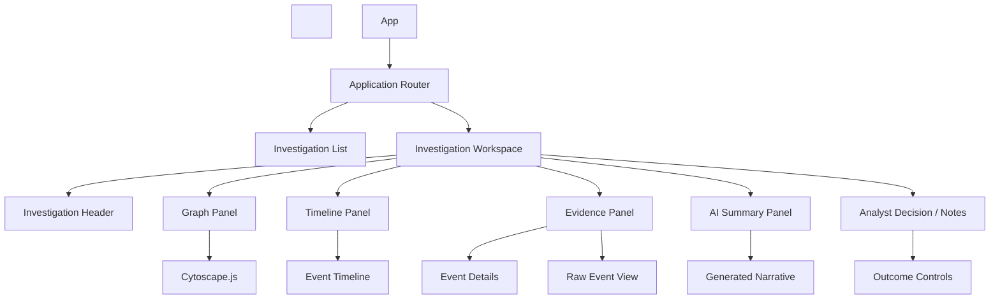

# Design Document: TraceGraph

## Overview

TraceGraph is designed as a modular security-investigation platform that converts scattered security evidence into an explainable investigation context.

The architecture deliberately separates:

1. Evidence ingestion  
2. Parsing  
3. Normalization  
4. Schema validation  
5. Entity extraction  
6. Relationship extraction  
7. Temporal correlation  
8. Graph persistence  
9. Timeline construction  
10. Evidence retrieval  
11. AI-assisted summarization  
12. Analyst interaction

The design does not make a specific SIEM a dependency. A SIEM, EDR, Sysmon, firewall, authentication source, direct system log, public dataset, or controlled simulation can provide the input evidence as long as an adapter can map the source into the common event model.

The investigation engine is intentionally explainable in the first implementation. Correlation is rule-based and time-aware rather than dependent on a black-box graph neural network. Graph learning can be evaluated later as a research extension after the baseline system is working and measurable.

---

# Part 1 — High-Level Design

## 1.1 System Architecture Overview

```mermaid
graph TD

&nbsp;

&nbsp;&nbsp;&nbsp;&nbsp;subgraph Evidence["Security Evidence Sources"]
&nbsp;&nbsp;&nbsp;&nbsp;&nbsp;&nbsp;&nbsp;&nbsp;SIEM["SIEM Export"]
&nbsp;&nbsp;&nbsp;&nbsp;&nbsp;&nbsp;&nbsp;&nbsp;EDR["EDR Export"]
&nbsp;&nbsp;&nbsp;&nbsp;&nbsp;&nbsp;&nbsp;&nbsp;Sysmon["Sysmon / Endpoint Logs"]
&nbsp;&nbsp;&nbsp;&nbsp;&nbsp;&nbsp;&nbsp;&nbsp;Auth["Authentication / AD / Linux Logs"]
&nbsp;&nbsp;&nbsp;&nbsp;&nbsp;&nbsp;&nbsp;&nbsp;Network["Network / Firewall Events"]
&nbsp;&nbsp;&nbsp;&nbsp;&nbsp;&nbsp;&nbsp;&nbsp;Dataset["Public Dataset / Simulation"]
&nbsp;&nbsp;&nbsp;&nbsp;end

&nbsp;

&nbsp;&nbsp;&nbsp;&nbsp;subgraph Backend["TraceGraph Backend"]
&nbsp;&nbsp;&nbsp;&nbsp;&nbsp;&nbsp;&nbsp;&nbsp;API["FastAPI API"]

&nbsp;

&nbsp;&nbsp;&nbsp;&nbsp;&nbsp;&nbsp;&nbsp;&nbsp;Parser["Source Parser / Adapter"]
&nbsp;&nbsp;&nbsp;&nbsp;&nbsp;&nbsp;&nbsp;&nbsp;Normalize["Normalization Service"]
&nbsp;&nbsp;&nbsp;&nbsp;&nbsp;&nbsp;&nbsp;&nbsp;Validate["Schema Validation"]

&nbsp;

&nbsp;&nbsp;&nbsp;&nbsp;&nbsp;&nbsp;&nbsp;&nbsp;Entity["Entity Extraction"]
&nbsp;&nbsp;&nbsp;&nbsp;&nbsp;&nbsp;&nbsp;&nbsp;Relation["Relationship Extraction"]
&nbsp;&nbsp;&nbsp;&nbsp;&nbsp;&nbsp;&nbsp;&nbsp;Correlator["Rule-based Temporal Correlation"]

&nbsp;

&nbsp;&nbsp;&nbsp;&nbsp;&nbsp;&nbsp;&nbsp;&nbsp;GraphService["Neo4j Graph Service"]
&nbsp;&nbsp;&nbsp;&nbsp;&nbsp;&nbsp;&nbsp;&nbsp;TimelineService["Timeline / Evidence Service"]

&nbsp;

&nbsp;&nbsp;&nbsp;&nbsp;&nbsp;&nbsp;&nbsp;&nbsp;AISvc["AI Summary Service"]
&nbsp;&nbsp;&nbsp;&nbsp;&nbsp;&nbsp;&nbsp;&nbsp;CaseService["Investigation / Case Service"]
&nbsp;&nbsp;&nbsp;&nbsp;end

&nbsp;

&nbsp;&nbsp;&nbsp;&nbsp;subgraph Storage["Data Layer"]
&nbsp;&nbsp;&nbsp;&nbsp;&nbsp;&nbsp;&nbsp;&nbsp;Neo4j["Neo4j\nInvestigation Graph"]
&nbsp;&nbsp;&nbsp;&nbsp;&nbsp;&nbsp;&nbsp;&nbsp;Postgres["PostgreSQL\nCase Metadata"]
&nbsp;&nbsp;&nbsp;&nbsp;end

&nbsp;

&nbsp;&nbsp;&nbsp;&nbsp;subgraph Frontend["Analyst Interface"]
&nbsp;&nbsp;&nbsp;&nbsp;&nbsp;&nbsp;&nbsp;&nbsp;React["React.js Application"]
&nbsp;&nbsp;&nbsp;&nbsp;&nbsp;&nbsp;&nbsp;&nbsp;Cytoscape["Cytoscape.js Graph"]
&nbsp;&nbsp;&nbsp;&nbsp;&nbsp;&nbsp;&nbsp;&nbsp;Timeline["Investigation Timeline"]
&nbsp;&nbsp;&nbsp;&nbsp;&nbsp;&nbsp;&nbsp;&nbsp;Evidence["Evidence / Event Panel"]
&nbsp;&nbsp;&nbsp;&nbsp;&nbsp;&nbsp;&nbsp;&nbsp;Summary["AI Summary Panel"]
&nbsp;&nbsp;&nbsp;&nbsp;end

&nbsp;

&nbsp;&nbsp;&nbsp;&nbsp;SIEM --> API
&nbsp;&nbsp;&nbsp;&nbsp;EDR --> API
&nbsp;&nbsp;&nbsp;&nbsp;Sysmon --> API
&nbsp;&nbsp;&nbsp;&nbsp;Auth --> API
&nbsp;&nbsp;&nbsp;&nbsp;Network --> API
&nbsp;&nbsp;&nbsp;&nbsp;Dataset --> API

&nbsp;

&nbsp;&nbsp;&nbsp;&nbsp;API --> Parser
&nbsp;&nbsp;&nbsp;&nbsp;Parser --> Normalize
&nbsp;&nbsp;&nbsp;&nbsp;Normalize --> Validate
&nbsp;&nbsp;&nbsp;&nbsp;Validate --> Entity
&nbsp;&nbsp;&nbsp;&nbsp;Validate --> Relation
&nbsp;&nbsp;&nbsp;&nbsp;Entity --> Correlator
&nbsp;&nbsp;&nbsp;&nbsp;Relation --> Correlator

&nbsp;

&nbsp;&nbsp;&nbsp;&nbsp;Correlator --> GraphService
&nbsp;&nbsp;&nbsp;&nbsp;Correlator --> TimelineService

&nbsp;

&nbsp;&nbsp;&nbsp;&nbsp;GraphService --> Neo4j
&nbsp;&nbsp;&nbsp;&nbsp;CaseService --> Postgres

&nbsp;

&nbsp;&nbsp;&nbsp;&nbsp;GraphService --> React
&nbsp;&nbsp;&nbsp;&nbsp;TimelineService --> React
&nbsp;&nbsp;&nbsp;&nbsp;React --> Cytoscape
&nbsp;&nbsp;&nbsp;&nbsp;React --> Timeline
&nbsp;&nbsp;&nbsp;&nbsp;React --> Evidence

&nbsp;

&nbsp;&nbsp;&nbsp;&nbsp;GraphService --> AISvc
&nbsp;&nbsp;&nbsp;&nbsp;TimelineService --> AISvc
&nbsp;&nbsp;&nbsp;&nbsp;AISvc --> Summary
```



### Architectural Responsibility

**Evidence Sources**

- Provide the underlying security events.  
- May already perform alerting/detection.  
- Are external to TraceGraph.

**FastAPI API**

- Provides the application boundary.  
- Validates requests.  
- Starts ingestion and investigation workflows.  
- Exposes graph, timeline, evidence, and summary endpoints.

**Parser/Adapter Layer**

- Understands source-specific formats.  
- Converts source events into an intermediate structured representation.

**Normalization Service**

- Maps equivalent vendor-specific fields into common TraceGraph fields.  
- Standardizes timestamps, identifiers, and representations.

**Schema Validation**

- Ensures events are structurally valid before processing.

**Entity Extraction**

- Converts event fields into graph entity candidates.

**Relationship Extraction**

- Converts explicit event semantics into evidence-backed graph relationships.

**Rule-Based Temporal Correlation**

- Determines which events/entities have meaningful contextual relationships.  
- Produces explainable correlation metadata.

**Neo4j**

- Stores investigation entities and relationships.  
- Provides graph traversal and pivoting.

**PostgreSQL**

- Stores application/case metadata when enabled.  
- It is not the primary store for relationship traversal.

**Timeline/Evidence Service**

- Provides chronological events and source evidence.

**AI Summary Service**

- Receives bounded, investigation-relevant context.  
- Produces an evidence-grounded narrative.  
- Does not make the final analyst decision.

**React/Cytoscape.js**

- Provides the analyst workspace.  
- Graph shows relationships.  
- Timeline shows temporal order.  
- Evidence panel shows the supporting source events.  
- Summary panel presents generated narrative.

---

## 1.2 Investigation Workflow

```mermaid
sequenceDiagram
&nbsp;&nbsp;&nbsp;&nbsp;participant A as Analyst
&nbsp;&nbsp;&nbsp;&nbsp;participant UI as React UI
&nbsp;&nbsp;&nbsp;&nbsp;participant API as FastAPI
&nbsp;&nbsp;&nbsp;&nbsp;participant P as Parser
&nbsp;&nbsp;&nbsp;&nbsp;participant N as Normalizer
&nbsp;&nbsp;&nbsp;&nbsp;participant V as Validator
&nbsp;&nbsp;&nbsp;&nbsp;participant E as Entity/Relation Extractor
&nbsp;&nbsp;&nbsp;&nbsp;participant C as Correlator
&nbsp;&nbsp;&nbsp;&nbsp;participant G as Neo4j
&nbsp;&nbsp;&nbsp;&nbsp;participant AI as AI Summary

&nbsp;

&nbsp;&nbsp;&nbsp;&nbsp;A->>UI: Create / open investigation
&nbsp;&nbsp;&nbsp;&nbsp;UI->>API: Investigation request

&nbsp;

&nbsp;&nbsp;&nbsp;&nbsp;A->>UI: Submit selected security evidence
&nbsp;&nbsp;&nbsp;&nbsp;UI->>API: Evidence ingestion request

&nbsp;

&nbsp;&nbsp;&nbsp;&nbsp;API->>P: Parse raw event
&nbsp;&nbsp;&nbsp;&nbsp;P->>N: Parsed fields
&nbsp;&nbsp;&nbsp;&nbsp;N->>V: Normalized event
&nbsp;&nbsp;&nbsp;&nbsp;V->>E: Valid SecurityEvent

&nbsp;

&nbsp;&nbsp;&nbsp;&nbsp;E->>C: Entities + relationships
&nbsp;&nbsp;&nbsp;&nbsp;C->>G: Correlated graph data

&nbsp;

&nbsp;&nbsp;&nbsp;&nbsp;UI->>API: Request graph + timeline
&nbsp;&nbsp;&nbsp;&nbsp;API->>G: Query investigation
&nbsp;&nbsp;&nbsp;&nbsp;G-->>API: Graph context
&nbsp;&nbsp;&nbsp;&nbsp;API-->>UI: Graph + evidence references

&nbsp;

&nbsp;&nbsp;&nbsp;&nbsp;A->>UI: Request investigation summary
&nbsp;&nbsp;&nbsp;&nbsp;UI->>API: Summary request
&nbsp;&nbsp;&nbsp;&nbsp;API->>AI: Selected structured context
&nbsp;&nbsp;&nbsp;&nbsp;AI-->>API: Evidence-grounded summary
&nbsp;&nbsp;&nbsp;&nbsp;API-->>UI: Summary

&nbsp;

&nbsp;&nbsp;&nbsp;&nbsp;A->>UI: Record analyst decision/notes
&nbsp;&nbsp;&nbsp;&nbsp;UI->>API: Investigation outcome
```

---

## 1.3 Component Hierarchy



---

# Part 2 — Low-Level Design

## 2.1 Common Security Event Model

The common event schema is the contract between ingestion and every downstream component.

Conceptual Pydantic model:

```py
from datetime import datetime
from pydantic import BaseModel

class SecurityEvent(BaseModel):
    event_id: str
    timestamp: datetime
    event_type: str
    action: str

    user: str | None = None

    source_host: str | None = None
    destination_host: str | None = None

    source_ip: str | None = None
    destination_ip: str | None = None

    process: str | None = None
    file: str | None = None

    severity: str | None = None

    raw_data: dict | None = None
```

### Design Rules

- `event_id` identifies the source event.  
- `timestamp` represents the normalized event time.  
- `event_type` categorizes the source event.  
- `action` captures the event's principal operation.  
- User/host/IP/process/file fields are optional because not every event contains every entity.  
- `raw_data` preserves source-specific evidence where appropriate.  
- The model is deliberately minimal for the first implementation.

---

## 2.2 Parsing and Source Adapters

The parser layer must isolate vendor-specific assumptions.

Example conceptual source mapping:

```text
Source A
AccountName        -> user
ComputerName       -> source_host
UtcTime             -> timestamp
Image               -> process

&nbsp;

Source B
username            -> user
hostname            -> source_host
event_time          -> timestamp
process_name        -> process
```

### Parser Responsibilities

1. Identify the source format.  
2. Extract raw fields.  
3. Convert field values to primitive types where possible.  
4. Preserve unknown fields.  
5. Return parsing errors with event/source context.  
6. Pass parsed information to normalization.

### Parser Non-Responsibilities

The parser must not:

- decide whether an event is malicious;  
- correlate events;  
- create Neo4j nodes;  
- make analyst decisions;  
- call an LLM.

This separation prevents ingestion code from becoming tightly coupled to investigation logic.

---

## 2.3 Normalization Service

Normalization makes different sources compatible with one internal model.

The normalization stage performs:

```text

Raw source fields (

&nbsp;&nbsp;&nbsp;&nbsp;&nbsp;&nbsp;&nbsp;↓
Field mapping
&nbsp;&nbsp;&nbsp;&nbsp;&nbsp;&nbsp;&nbsp;↓
Value normalization
&nbsp;&nbsp;&nbsp;&nbsp;&nbsp;&nbsp;&nbsp;↓
Timestamp normalization
&nbsp;&nbsp;&nbsp;&nbsp;&nbsp;&nbsp;&nbsp;↓
Identifier normalization
&nbsp;&nbsp;&nbsp;&nbsp;&nbsp;&nbsp;&nbsp;↓
SecurityEvent
```

### Timestamp Handling

All timestamps should be stored in a consistent representation, preferably UTC. The original timezone/source representation should be retained where useful for auditability.

### Identifier Handling

The service should normalize:

- host naming conventions;  
- username representation;  
- IP representation;  
- process naming;  
- file paths where safe and justified.

The normalization layer must not over-normalize values in a way that destroys evidence.

---

## 2.4 Entity Extraction

Entity extraction maps normalized event fields to graph nodes.

Example:

```text
Event:
timestamp = 10:15
user = Rahul
source_host = ENG-PC-27
process = powershell.exe
action = execute
```

Entity candidates:

```text
(:User {name: "Rahul"})
(:Host {name: "ENG-PC-27"})
(:Process {name: "powershell.exe"})
```

### Entity Identity

Entity identity must be deterministic enough to prevent duplicate nodes while allowing different entities with similar names where the source context requires it.

Initial rules:

- User identity primarily uses normalized account name.  
- Host identity primarily uses normalized host name.  
- IP identity uses normalized IP value.  
- Process identity uses process name plus contextual attributes where needed.  
- File identity uses normalized path/name where appropriate.

Entity extraction does not assert that an entity is malicious.

---

## 2.5 Relationship Extraction

Relationships describe actions observed in events.

Example:

```text
User --LOGGED_INTO--> Host
Host --EXECUTED-----> Process
Host --CONNECTED_TO-> Server
Server --ACCESSED----> File
```

Each relationship should maintain metadata similar to:

```json
{
  "relationship_type": "EXECUTED",
  "timestamp": "2026-09-18T10:02:00Z",
  "event_id": "evt-1002",
  "source": "Sysmon",
  "correlation_signals": []
}
```

When several source events support the same relationship, the implementation should preserve their references instead of replacing previous evidence.

---

## 2.6 Temporal Correlation Engine

The correlation engine is the core investigation-logic layer.

The initial implementation is intentionally deterministic and explainable.

### Candidate Signals

For an event pair or event-to-context relationship, the engine can consider:

```text
Shared user
Shared host
Shared source/destination IP
Host continuity
Temporal proximity
Compatible action sequence
Shared process context
Shared file/resource context
```

### Conceptual Process

```text
New event
&nbsp;&nbsp;&nbsp;↓
Find candidate nearby events
&nbsp;&nbsp;&nbsp;↓
Check shared context
&nbsp;&nbsp;&nbsp;↓
Check temporal relationship
&nbsp;&nbsp;&nbsp;↓
Check action compatibility
&nbsp;&nbsp;&nbsp;↓
Produce correlation metadata
&nbsp;&nbsp;&nbsp;↓
Create/extend evidence-backed relationship
```

### Relationship Strength

A relationship-strength field may be introduced as an internal ranking aid.

Example conceptual signals:

```text
entity_match
temporal_proximity
host_continuity
action_compatibility
```

Important design rule:

**Relationship strength is not attack probability.**

The implementation should not hard-code claims such as "this edge has an 80% chance of being malicious" without a trained and evaluated model.

The exact weights should be experimentally tuned using controlled scenarios and datasets.

---

## 2.7 Candidate Retrieval vs Correlation

These operations are deliberately separate.

### Candidate Retrieval

Answers:

> Which events are worth considering together?

Typical constraints:

- same investigation;  
- time window;  
- shared user/host/IP;  
- indexed event fields.

### Correlation

Answers:

> Do these candidate events have enough meaningful contextual relationship to represent together?

This distinction prevents database traversal or simple BFS/DFS from being incorrectly described as an attack-detection algorithm.

---

## 2.8 Neo4j Graph Data Model

### Node Types

Initial node labels:

```text
User
Host
Server
IP
Process
File
```

### Relationship Types

Initial relationship labels:

```text
LOGGED_INTO
AUTHENTICATED_TO
EXECUTED
CONNECTED_TO
ACCESSED
```

### Example

```text
(:User {name: "Rahul"})
&nbsp;&nbsp;&nbsp;&nbsp;-[:LOGGED_INTO {timestamp, event_ids}]->
(:Host {name: "ENG-PC-27"})

&nbsp;

(:Host {name: "ENG-PC-27"})
&nbsp;&nbsp;&nbsp;&nbsp;-[:EXECUTED {timestamp, event_ids}]->
(:Process {name: "powershell.exe"})

&nbsp;

(:Host {name: "ENG-PC-27"})
&nbsp;&nbsp;&nbsp;&nbsp;-[:CONNECTED_TO {timestamp, event_ids}]->
(:Server {name: "FIN-SRV-02"})

&nbsp;

(:Server {name: "FIN-SRV-02"})
&nbsp;&nbsp;&nbsp;&nbsp;-[:ACCESSED {timestamp, event_ids}]->
(:File {path: "FinancialReport.xlsx"})
```

### Relationship Metadata

Relationships should carry:

- timestamp or first/last observed timestamps;  
- event IDs;  
- source;  
- correlation signals;  
- optional relationship-strength value;  
- investigation ID where needed.

---

## 2.9 Graph Query and Pivot Design

Typical analyst query:

> Starting from ENG-PC-27, show connected activity within the previous and next 15 minutes.

Conceptual query:

```cypher
MATCH (h:Host {name: $host})-[r]-(n)
WHERE r.timestamp >= $start_time
&nbsp;&nbsp;AND r.timestamp <= $end_time
RETURN h, r, n
ORDER BY r.timestamp
```

The exact query implementation should be optimized after the actual graph data model is implemented.

### Pivot Types

- Host → User activity  
- Host → Processes  
- Host → Network destinations  
- Server → Users  
- User → Hosts  
- Process → Network connections  
- Server → Accessed files

---

## 2.10 Timeline Service

The timeline is generated from the same normalized evidence used by the graph.

A timeline item contains:

```text
timestamp
event_id
event_type
action
user
source_host
destination_host
process
file
source
relationship references
```

The timeline and graph must refer to the same evidence IDs so that an analyst can move between the two views without losing context.

---

## 2.11 Evidence Detail Model

When an analyst selects an event or relationship, the frontend should be able to request:

```text
Event identity
Normalized event
Raw/source event
Source name
Timestamp
Extracted entities
Derived relationships
Correlation signals
```

This prevents the graph from becoming a visual black box.

---

## 2.12 Investigation Case Metadata

When PostgreSQL is enabled, it stores application metadata such as:

```text
investigation_id
title
description
status
created_at
updated_at
created_by
closed_at
analyst_notes
outcome
```

Neo4j remains responsible for relationship-centric investigation data.

This separation keeps:

- relational application metadata in PostgreSQL;  
- graph relationships and traversal in Neo4j.

---

## 2.13 AI Summary Service

The LLM is placed after graph/timeline construction.

```text
Raw Events
&nbsp;&nbsp;&nbsp;&nbsp;↓
Normalization
&nbsp;&nbsp;&nbsp;&nbsp;↓
Correlation
&nbsp;&nbsp;&nbsp;&nbsp;↓
Graph + Timeline
&nbsp;&nbsp;&nbsp;&nbsp;↓
Relevant Evidence Retrieval
&nbsp;&nbsp;&nbsp;&nbsp;↓
Structured Investigation Context
&nbsp;&nbsp;&nbsp;&nbsp;↓
LLM
&nbsp;&nbsp;&nbsp;&nbsp;↓
Summary
```

### The LLM receives

- investigation description;  
- relevant timeline events;  
- graph paths;  
- entities involved;  
- relationship types;  
- correlation evidence;  
- event IDs;  
- unresolved/ambiguous context.

### The LLM should produce

1. Investigation overview  
2. Chronological sequence  
3. Important entities  
4. Important relationships  
5. Supporting evidence references  
6. Uncertainty / missing context  
7. Questions the analyst may want to investigate next

### The LLM should not

- inspect unrelated data unnecessarily;  
- invent events;  
- invent relationships;  
- state unsupported maliciousness;  
- automatically close the case;  
- automatically trigger remediation.

The LLM is therefore a **summarization and context-assistance component**, not the core investigation engine.

---

# Part 3 — Frontend and Analyst Experience

## 3.1 Investigation Workspace

The main screen is designed around the analyst's investigation workflow.

```text
+--------------------------------------------------------------+
| Investigation Header / Status / Time Range                  |
+---------------------------+----------------------------------+
|                           |                                  |
|      Graph View           |       Timeline                   |
|                           |                                  |
|   User -> Host -> Proc    | 10:00 Login                      |
|             -> Server     | 10:02 PowerShell                 |
|             -> File       | 10:04 Network Connection         |
|                           | 10:06 File Access                |
|                           |                                  |
+---------------------------+----------------------------------+
| Evidence / Event Details | AI Summary / Analyst Notes       |
+---------------------------+----------------------------------+
```

The exact visual layout may change during implementation, but the information architecture should remain centered on graph \+ timeline \+ evidence.

---

## 3.2 Graph Interaction

The graph should support:

- pan;  
- zoom;  
- node selection;  
- edge selection;  
- entity-type styling;  
- filtering;  
- time-range restriction;  
- expansion of selected nodes;  
- evidence lookup.

Selecting a node should identify its entity and relevant supporting events.

Selecting an edge should identify:

- relationship type;  
- timestamp;  
- supporting event IDs;  
- source;  
- correlation signals.

---

## 3.3 Timeline Interaction

Timeline features:

- chronological event list;  
- event grouping where useful;  
- time-range filter;  
- entity filter;  
- event-type filter;  
- click-to-open evidence.

The timeline must not silently reorder events according to graph importance. Chronological order is based on event timestamps.

---

## 3.4 Evidence Panel

The evidence panel is the analyst's verification view.

Example:

```text
Event ID: evt-1004
Source: Sysmon
Timestamp: 10:04 UTC
Type: Network
Action: connect

&nbsp;

Normalized:
source_host: ENG-PC-27
destination_host: FIN-SRV-02

&nbsp;

Supports:
ENG-PC-27 CONNECTED_TO FIN-SRV-02

&nbsp;

Correlation:
- shared host with previous event
- 2 minutes after process execution
- compatible investigation sequence
```

This makes derived graph content explainable.

---

## 3.5 AI Summary Panel

The summary panel should visibly distinguish AI-generated text from source evidence.

Recommended structure:

```text
AI-Generated Investigation Summary

&nbsp;

Observed sequence
...

&nbsp;

Key entities
...

&nbsp;

Supporting evidence
evt-1001
evt-1002
evt-1003
evt-1004

&nbsp;

Uncertainty / additional context
...

&nbsp;

[Review Evidence]
```

---

## 3.6 Analyst Decision Panel

The analyst can record:

```text
Status:
[ Open ] [ Under Review ] [ Closed ]

&nbsp;

Outcome:
[ Continue ] [ Escalate ] [ Close as Investigated ]

&nbsp;

Notes:
........................................
```

The implementation should keep this workflow separate from automated AI output.

---

# Part 4 — API Design

## 4.1 Investigation APIs

Conceptual endpoints:

```text
POST   /api/investigations
GET    /api/investigations
GET    /api/investigations/{id}
PATCH  /api/investigations/{id}
```

---

## 4.2 Evidence APIs

```text
POST   /api/investigations/{id}/events
POST   /api/investigations/{id}/events/batch
GET    /api/investigations/{id}/events
GET    /api/events/{event_id}
```

---

## 4.3 Graph APIs

```text
GET    /api/investigations/{id}/graph
GET    /api/investigations/{id}/graph/pivot
GET    /api/investigations/{id}/entities/{entity_id}
```

Possible query parameters:

```text
start_time
end_time
entity_type
relationship_type
depth
limit
```

---

## 4.4 Timeline APIs

```text
GET /api/investigations/{id}/timeline
```

Possible filters:

```text
start_time
end_time
entity
event_type
action
```

---

## 4.5 AI APIs

```text
POST /api/investigations/{id}/summary
GET  /api/investigations/{id}/summary
```

The summary endpoint should build the relevant evidence context server-side rather than accepting arbitrary raw content from the browser.

---

## 4.6 Analyst Decision APIs

```text
POST  /api/investigations/{id}/notes
PATCH /api/investigations/{id}/outcome
PATCH /api/investigations/{id}/status
```

---

# Part 5 — Cross-Cutting Concerns

## 5.1 Security

- Environment variables for secrets.  
- No API keys committed to the repository.  
- Authentication/authorization around protected investigation endpoints.  
- HTTPS in production.  
- Least-privilege database accounts.  
- Sensitive logging minimized.  
- Raw security evidence treated as confidential.  
- Access controlled at investigation level where required.

---

## 5.2 Error Handling

Each layer should expose errors in a consistent form.

Example:

```json
{
  "status": 400,
  "error": "VALIDATION_ERROR",
  "message": "timestamp is required",
  "event_id": "evt-1003"
}
```

Infrastructure failures should not appear as malformed investigation data.

AI failure should degrade gracefully:

```text
Graph available
Timeline available
Evidence available
AI summary unavailable
```

The analyst can continue investigating without the LLM.

---

## 5.3 Logging

Application logs should identify:

- request ID;  
- investigation ID;  
- event ID;  
- processing stage;  
- success/failure;  
- processing time.

Raw sensitive event content should not be copied into application logs unless required for debugging in a controlled environment.

---

## 5.4 Observability

The pipeline should expose enough information to measure:

```text
events ingested
events successfully parsed
events rejected
normalization failures
entities extracted
relationships extracted
correlations produced
graph write time
graph query time
AI summary generation time
```

These measurements support the evaluation phase.

---

# Part 6 — Package Structure

```text
tracegraph/
├── backend/
│   ├── app/
│   │   ├── api/
│   │   │   ├── investigations.py
│   │   │   ├── events.py
│   │   │   ├── graph.py
│   │   │   ├── timeline.py
│   │   │   └── summary.py
│   │   │
│   │   ├── models/
│   │   │   ├── events.py
│   │   │   ├── investigations.py
│   │   │   └── responses.py
│   │   │
│   │   ├── schemas/
│   │   │   ├── event_schema.py
│   │   │   ├── graph_schema.py
│   │   │   └── investigation_schema.py
│   │   │
│   │   ├── services/
│   │   │   ├── parsing/
│   │   │   ├── normalization/
│   │   │   ├── extraction/
│   │   │   ├── correlation/
│   │   │   ├── graph/
│   │   │   ├── timeline/
│   │   │   └── ai/
│   │   │
│   │   ├── repositories/
│   │   │   ├── neo4j_repository.py
│   │   │   └── investigation_repository.py
│   │   │
│   │   ├── core/
│   │   │   ├── config.py
│   │   │   ├── logging.py
│   │   │   └── security.py
│   │   │
│   │   └── main.py
│   │
│   ├── tests/
│   │   ├── unit/
│   │   ├── integration/
│   │   └── fixtures/
│   │
│   └── requirements.txt
│
├── frontend/
│   ├── src/
│   │   ├── components/
│   │   │   ├── graph/
│   │   │   ├── timeline/
│   │   │   ├── evidence/
│   │   │   ├── summary/
│   │   │   └── common/
│   │   ├── pages/
│   │   │   ├── Investigations.jsx
│   │   │   └── InvestigationWorkspace.jsx
│   │   ├── services/
│   │   │   ├── api.js
│   │   │   ├── investigationService.js
│   │   │   ├── graphService.js
│   │   │   └── summaryService.js
│   │   ├── hooks/
│   │   └── utils/
│   └── package.json
│
├── data/
│   ├── raw/
│   ├── normalized/
│   ├── scenarios/
│   └── fixtures/
│
├── docs/
│   ├── Requirements_Document.md
│   ├── Design_Document.md
│   └── Implementation_Plan.md
│
├── docker-compose.yml
├── .env.example
└── README.md
```

---

# Part 7 — Technology Responsibilities

| Technology | Responsibility |
| :---- | :---- |
| Python | Core backend implementation, security-event processing, parsing, normalization, correlation, graph integration, AI integration |
| FastAPI | REST API and backend orchestration |
| Pydantic | Validation and common event/data schemas |
| Neo4j | Investigation graph storage and traversal |
| PostgreSQL | Investigation/case metadata when enabled |
| React.js | Analyst-facing web application |
| Cytoscape.js | Interactive graph rendering |
| LLM | Evidence-grounded investigation summarization |
| Docker | Reproducible local/development deployment |
| Git/GitHub | Source collaboration and version history |

The initial design intentionally does not depend on Java. Python is the main application language because the core workload is structured security-event processing, graph data handling, and AI integration.

---

# Part 8 — Future Architectural Extensions

Potential future extensions include:

- streaming ingestion;  
- additional source adapters;  
- richer temporal correlation;  
- analyst feedback;  
- attack-path analysis;  
- learned graph models;  
- temporal graph neural networks;  
- graph anomaly detection;  
- cloud and identity telemetry;  
- multi-tenant deployment.

These are extensions and should not be allowed to destabilize the first working investigation pipeline.

&nbsp;